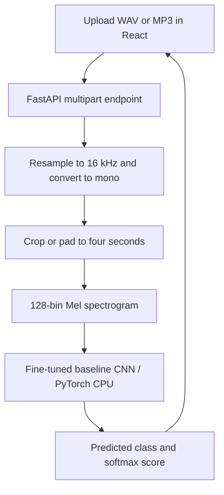

# Voice Anti-Spoofing Web App

**From an audio classifier to a deployed prediction interface.**

[Live frontend](https://voiceantispoofing.netlify.app/) · [Training project](https://github.com/Laabh-Gupta/Voice_Anti_Spoofing_System) · [Model artifacts](https://huggingface.co/LaabhGupta/voice-antispoofing)

A React and FastAPI application for classifying uploaded speech as **fake** or **real**. This repository contains the web interface and serving code. The linked research repository contains the CNN/ViT experiments.

## What I built

The application connects browser uploads to a PyTorch inference pipeline, loads a trained checkpoint from Hugging Face Hub, and returns a predicted class and softmax score. The frontend is hosted on Netlify; the repository includes a Render backend configuration.

## How inference works



[Preprocessing and endpoint](audio_app/main.py) use `n_fft=1024` and `hop_length=512`. The [baseline model](audio_app/model.py) has three convolution/ReLU/max-pooling blocks, followed by a dense classifier and dropout. The server explicitly loads **`baseline_cnn_finetuned.pth`**.

## Research results & provenance

| Model in the original project | Reported test accuracy |
| --- | ---: |
| Fine-tuned baseline CNN | **99.51%** |
| Fine-tuned deeper CNN | **99.63%** |
| Fine-tuned Vision Transformer | **99.75%** |

These are the original project's results, retained as confirmed by the author. The public training repository is a smaller variant and its saved notebook outputs are from a different run. These figures are not a fresh reproduction or measured accuracy of this hosted app. **The web backend serves the baseline CNN, not the ViT.**

Training explores Mel spectrograms, CNNs/ViT and time/frequency masking using the Fake or Real speech dataset. See [training methodology and evaluation limits](https://github.com/Laabh-Gupta/Voice_Anti_Spoofing_System#evaluation).

## Stack & deployment

- **Inference:** Python, PyTorch, Torchaudio and Hugging Face Hub.
- **API:** FastAPI, Uvicorn and multipart file uploads.
- **UI:** React 18 and Create React App.
- **Hosting:** Netlify frontend; [Render backend configuration](render.yaml). Model weights download at API startup.

A reachable frontend does not guarantee backend availability: hosting cold starts and model downloads can delay the first prediction.

## Run locally

Use **Python 3.10** and a Node.js/npm installation compatible with React Scripts 5.

```bash
git clone https://github.com/Laabh-Gupta/Voice-Anti-Spoofing-Web-App.git
cd Voice-Anti-Spoofing-Web-App
python -m venv .venv
```

Activate `.venv` using `.venv\Scripts\Activate.ps1` on PowerShell or `source .venv/bin/activate` on macOS/Linux.

The checked-in requirements mix package pins with per-line index options. This explicit equivalent separates the CPU PyTorch index:

```bash
python -m pip install "numpy<2" fastapi uvicorn requests python-multipart huggingface_hub soundfile
python -m pip install torch==2.2.0 torchaudio==2.2.0 torchvision==0.17.0 --index-url https://download.pytorch.org/whl/cpu
cd audio_app
python -m uvicorn main:app --host 127.0.0.1 --port 8000
```

The first startup needs network access to download the public checkpoint. Codec support depends on the Torchaudio installation; WAV is the simplest initial input.

In a second terminal:

```bash
cd Voice-Anti-Spoofing-Web-App/audio-classifier-frontend
npm install
```

Create `audio-classifier-frontend/.env.local`:

```dotenv
REACT_APP_BACKEND_URL=http://127.0.0.1:8000
```

Then run `npm start` and open `http://localhost:3000`. Restart the frontend after changing its environment. Use `npm run build` for a static frontend build.

### API

- `GET /`: basic service status.
- `POST /predict/`: multipart field named `file`; WAV or MP3.

```bash
curl -F "file=@sample.wav" http://127.0.0.1:8000/predict/
```

Successful responses contain `filename`, `predicted_class` and `confidence`. That score is a softmax output, not calibrated certainty that an audio clip is authentic.

## Project structure

```text
audio_app/                  FastAPI entry point, CNN definition and dependencies
audio-classifier-frontend/ React upload and result interface
render.yaml                 Backend hosting configuration
LICENSE                     MIT license
```

## Limitations

- Dataset-specific accuracy does not establish performance against unseen generators, codecs, languages or recording conditions.
- Only the first four seconds are analyzed when an upload is longer.
- Current serving code has broad CORS, no user authentication/rate limiting and no explicit upload-size cap. Review those controls before wider exposure.
- Dependencies and model downloads affect reproducibility. No latency, load-test or fresh benchmark result is claimed here.
- Inspectability comes from the linked preprocessing, model and endpoint code; the application does not establish forensic proof of authenticity.

[MIT license](LICENSE).
